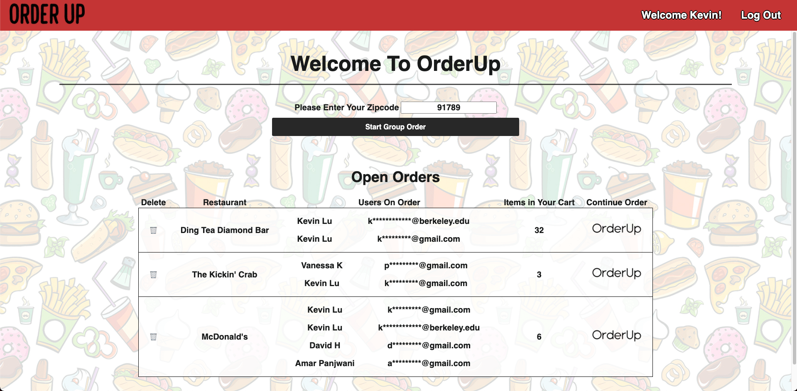
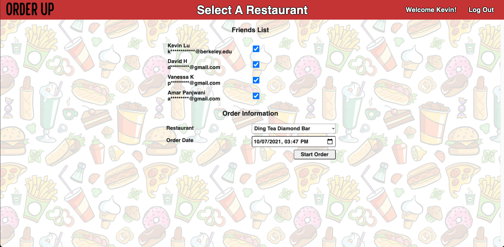
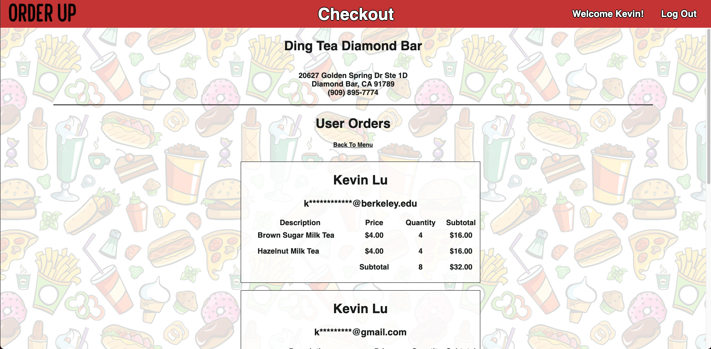

# OrderUp

Trello: https://trello.com/invite/b/NNzBOmWd/c3ae83bc37504fd9574224ecc4b92238/order-up

# About The Project
OrderUp is a group ordering app designed to facilitate placing an order at a restaurant.  Using the app, each person is able to start an order by searching for a restaurant(using their zipcode) and invite any other users that have registered with the app.  Each user that was invited will be able to log in and see the order in their Open Orders section.  They can then click through the link to add their own order to the group order. On the order page, users will be able to add or remove items to their cart which will update the page accordingly.  Once each user has submitted their orders, they will be able to see a summary of all their respective orders as well as the total for all orders.  On the final checkout page, any user is able to submit the order which will close the group order and will no longer show up as an open order on any of their home pages.  The app also keeps track of subtotals so everyone can see what each person has ordered and how much each of them needs to pitch in for the final bill.

# Screenshots

## Homepage

## Select A Restaurant

## Order Page

## Checkout

## Submit Order

## Thank You

# Technologies Used

* Javascript
* CSS
* HTML
* MongoDB
* Express
* Mongoose
* Node.js
* API

# Getting Started
* [Click to launch the app](https://orderupapp.herokuapp.com/orderup)

# Next Steps

## App Functions
* Allow users to access archived orders
* Allow users to send links to friends inviting them to order
* Allow users to search with additional parameters(State, Cuisine, Restaurant Name)
* Allow users to browse by cuisine category based on parameters
* Implement friends list by user (it currently shows all users that have registered)
* Allow users to invite additional friends after the group order has been created
* Allow users to customize their order for each menu item
* Allow users to adjust item quantities inside the cart

## External app functions
* Venmo requests
* Placing orders directly to restauarants 

